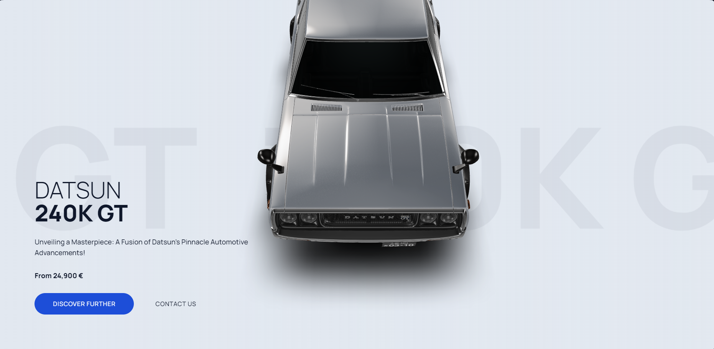

# 3D Car Animation Model - Nothing4us



Welcome to the README for the 3D Car Animation Model website by Nothing4us. This repository contains the HTML, CSS, and JavaScript code for the website. Here, you will find information about the website's structure, technologies used, and how to set it up locally.

## Table of Contents

- [Introduction](#introduction)
- [Technologies Used](#technologies-used)
- [Getting Started](#getting-started)
- [Usage](#usage)
- [Contributing](#contributing)
- [License](#license)

## Introduction

This website showcases a 3D car animation model. It provides an interactive experience for users to explore and learn more about the featured car model. The website incorporates modern web development technologies to create an engaging user interface.

## Technologies Used

The website utilizes the following technologies:

- HTML5
- CSS (Tailwind CSS)
- JavaScript (including [Swiper](https://swiperjs.com/), [gsap](https://greensock.com/gsap/), and [ScrollTrigger](https://greensock.com/scrolltrigger/))
- [Model Viewer](https://modelviewer.dev/) for 3D model rendering

## Getting Started

To run this website locally, follow these steps:

1. Clone the repository to your local machine:

   ```bash
   git clone https://github.com/your-username/3d-car-animation.git
   
2. **Open the cloned directory:**
   ```bash
   cd 3d-car-animation
   
3. **Open the `index.html` file** in your preferred web browser.

The website has been created to showcase a 3D car animation model. Users can interact with the model and explore various sections of the website. The website's structure includes:

- An interactive 3D car model.
- Detailed information about the car model.
- Color selection buttons.
- Navigation buttons for discovering more about the car and contacting the company.

Feel free to customize the content, colors, and styles to align with your preferences.

## Contributing

If you wish to contribute to this project, kindly adhere to the following steps:

1. **Fork the repository** to your own GitHub account.

2. Create a new branch for your changes using the following command:
   ```bash
   git checkout -b feature/new-feature
   
3. **Make your changes** and **commit** them with a descriptive message:

   ```bash
   git commit -m "Add new feature"

4. **Push your changes** to your fork:

   ```bash
   git push origin feature/new-feature

5. **Create a pull request** from your fork to the original repository.

## License

This project is licensed under the MIT License. Please refer to the `LICENSE` file for detailed licensing information.

Enjoy your exploration of the 3D car animation model website! If you have any questions or feedback, please feel free to reach out.


